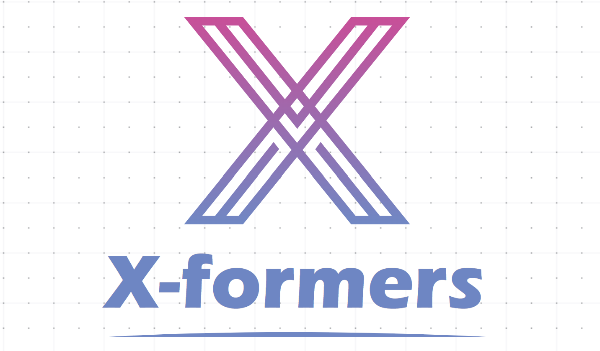

# X-Formers

`X-Formers` is a flax-based library for high-performance training of NLU models on TPUs. 

- [What's New](#whats-new)
- [Models](#models)
- [Kaggle Notebooks](#kaggle-notebooks)
- [Citing](#citing)

## What's New

### 5th August, 2022
* Working on Adding METRO and Moe
* Added my custom built deberta-long model

## Models 
* DeBERTa Long - Extended the original DeBERTa-V3 model with support for XLA compilation, long range modeling and tensor partioning

## Kaggle Notebooks
[ ] TODO: Add Kaggle notebooks here


## Citing

### BibTeX

```bibtex
@misc{sb2022xformers,
  author = {Sarthak Bhatt},
  title = {X-formers},
  year = {2022},
  publisher = {GitHub},
  journal = {GitHub repository},
  howpublished = {\url{https://github.com/sarthak-314/xformers}}
}
```