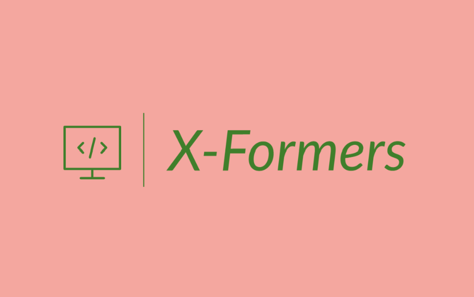

--------------------------------------------------------------------------------

# X-Formers

`X-Formers` is a flax-based library for high-performance training of NLU models on the Kaggle TPUv3-8 hardware. It is built with performance and scalability in mind.

Created on 4th August 2022

## Notebooks
[ ] TODO: Link notebooks using X-formers here